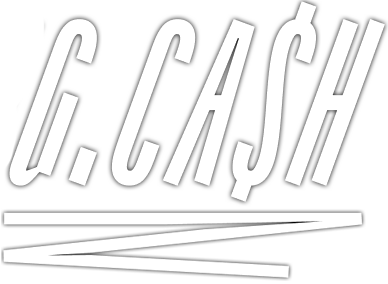

# Api ngcash



<br>

## Sobre a api ngcash
Api para consumo do front ngcash

### Endpoints
 - post '/users' Realiza o cadastro do usuário 
 - post '/login' Realizada a autenticação do usuário na api
 - post '/refresh-token' Faz o refresh no token do usuário
 - get '/account/balance' Retorna o saldo do usuário
 - post '/account/transaction' Realizar uma transação
 - get '/account/transactions-list' Lista de transações do usuário
 - get '/' Retorna status da api

<br>

## Tecnologias

Tecnologias e ferramentas utilizadas no desenvolvimento do projeto:

- [NodeJs](https://nodejs.org/en/)
- [TypeScript](https://www.typescriptlang.org/)

<br>

## Instalação e uso

```bash
# Abra um terminal e copie este repositório com o comando
git clone https://github.com/guerreiru/api.git
# ou use a opção de download.

# Entre na pasta web com 
cd api

# Instale as dependências
yarn install

# Rode a aplicação
yarn dev

# Utilize a url http://localhost:3333 para fazer sua requisições.
```

<br>

[](https://www.linkedin.com/in/guerreiru/) 
[](mailto:dev.fernandoguerreiro@gmail.com)
